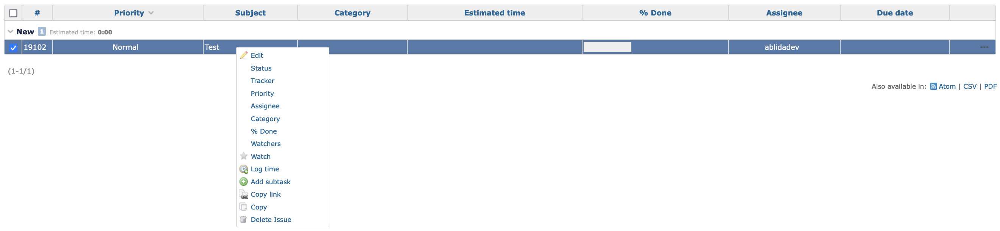
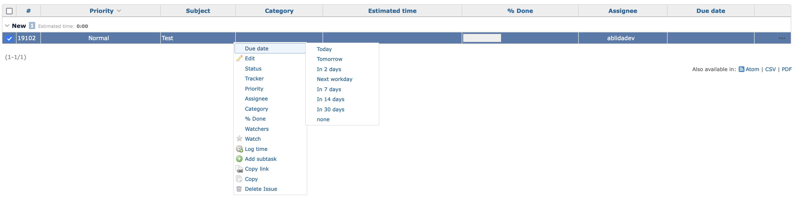

# Context Menu due Date

## Overview

Redmine plugin. Adds option to change issue due date via context menu on issues list.

## Introduction

[Redmine](http://www.redmine.org) with its functionality offers almost everything you need, we just had to extend the functionality for our internal needs, and this plugin was the result.

## Features

Adds option to change issue due date via context menu on issues list. Selectable options are:

-   Today
-   Tomorrow
-   In 2 days
-   Next workday
-   In 7 days
-   In 14 days
-   In 30 days

#### Without plugin:

#### With plugin:

## Installation

To install the plugin, either clone it or download it and xtract the directory into ur plugins directory in your redmine dir.

    git clone https://github.com/ablidadev/context_menu_due_date
    move context_menu_due_date into redmine/plugins/.

More information on installing Redmine plugins can be found here: [Redmine Plugins](http://www.redmine.org/wiki/redmine/Plugins)

After the plugin is installed, you will need to restart Redmine for the plugin to be available.

## How to actually use the plugin

### Overview

Once you have installed the Redmine context_menu_due_date properly, you do not need to make any further configurations, it will work seamlessly when the page is reloaded.

### About

* Copyright (c) 2021-2024 bokos, original author.